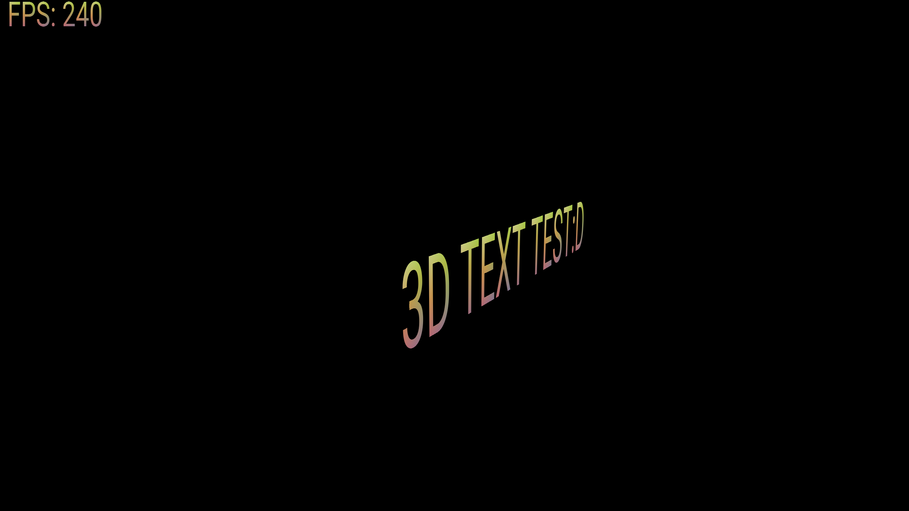

# Text rendering from glyph outlines with SDL3 gpu api

Renders text based on glyph outlines in the fragment shader. Has a 3D and 2D
pipeline. The glyph outlines are preprocessed into the correct format
beforehand and is included as a binary file in ./data/glyph_buffer.data. That
file is then `#embed`ed into the final executable along with some other
information data.

